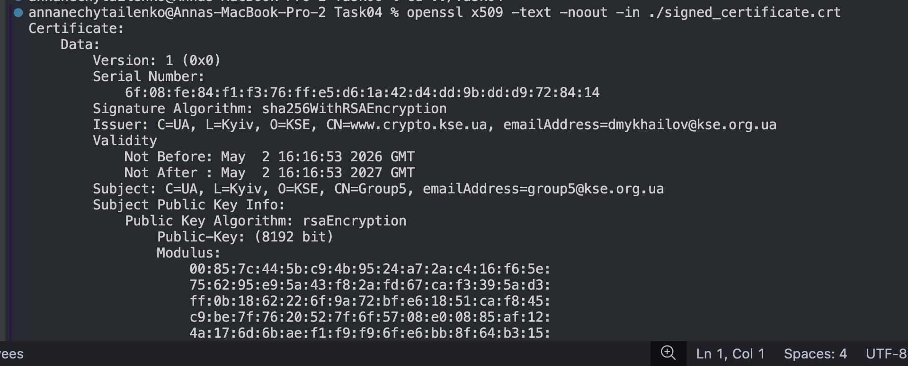
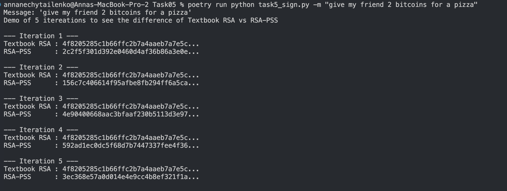
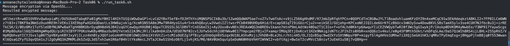
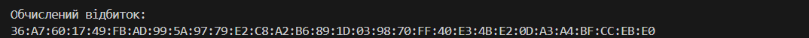

# PRACTICAL TASK #3-4 "Implementation of digital signature and certificates"

## Authors: 
- Oleksandrovych Anna: focused on low-level cryptographic programming by implementing a custom SHA-256 hash function, developing a proof-of-work mining script and calculating a certificate fingerprint.
- Nechytailenko Anna: managed PKI tasks by using OpenSSL to generate and cross-sign RSA keys, performing digital signatures and encryption and researching domain certificate histories.


## **1. Implementation of the hash function SHA-256:**

The SHA-256 algorithm works with data blocks of size 512 bits and creates a 256-bit output string. The implementation has the following stages:

**Preprocessing.** First, to the message is added the bit "1", then zeros are added so that the length of the message by modulo 512 equals 448, and into the last 64 bits is written the initial length of the message in bits. 

**Initialization.** Setting of eight 32-bit working variables h0, h1, h2, h3, h4, h5, h6, h7, obtained from the fractional parts of the square roots of the first eight prime numbers. 

**Compression cycle:** For each 512-bit block, 64 rounds of transformations are performed using constants k (cubic roots of the first 64 prime numbers) and bitwise operations.

**Code** : [here](Task01/main.py)

*Output*: 
```
 (b"", "e3b0c44298fc1c149afbf4c8996fb92427ae41e4649b934ca495991b7852b855"),
(b"abc", "ba7816bf8f01cfea414140de5dae2223b00361a396177a9cb410ff61f20015ad"),
(b"abcdbcdecdefdefgefghfghighijhijkijkljklmklmnlmnomnopnopq",
       "248d6a61d20638b8e5c026930c3e6039a33ce45964ff2167f6ecedd419db06c1"),
         (b"abcdefghbcdefghicdefghijdefghijkefghijklfghijklmghijklmnhijklmnoijklmnopjklmnopqklmnopqrlmnopqrsmnopqrstnopqrstu",
          "cf5b16a778af8380036ce59e7b0492370b249b11e8f07a51afac45037afee9d1")
```



## **2. Prefix Matching**

- For the message "give my friend 2 bitcoins for a pizza", a brute-force algorithm for a 20-byte prefix was implemented. We needed to find a prefix for which the result of the SHA-256(prefix + message) concatenation starts with 32 zero bits (8 zeros in hexadecimal representation). My laptop said this was hell for it. Initially, it tried running on a single core, which took 2, 4, 6 hours (couldn't stand waiting any longer) without any results. Then I had to consult with an AI on how to speed up this process, and it helped me add more workers to make it faster! It never managed to finish running in VS Code, but I caught a flashback from my machine learning course where some code also ran for 10 hours, and I decided to try running this code in parallel across several notebooks. Two cores were working there, and OH BINGO, one of them yielded a result!! (I have also attached the notebook to the assignment).

>It took about 1 hour and 34 minutes—which is a huge relief compared to 8 hours. This indicates a complexity of $2^{32}$, putting the odds of finding this hash at 1 in 4,294,967,296

- **Code**: [here](Task02/task2.py)
- **Notebook**: [here](Task02/Notebook.ipynb)

*Output*:
```
Ядер: 2. Старт!
Успіх за 5673.4с!
Префікс (HEX): 8e331c382ee12b0487954b678e22a3ce54583a18
Хеш: 00000000134420a740c32c44b49580995bc74745a92588e7c9a3a3c579d80e2a
```

## **3.Generating an RSA Key Pair and Self-Signed Certificate

**Step 1: Generating an 8192-bit RSA public and private key pair using OpenSSL**

```bash
openssl genpkey -algorithm RSA -out server.key -pkeyopt rsa_keygen_bits:8192
```

Output: [here](keys_and_certs/server.key)

**Step 2: Creating a Certificate Signing Request (CSR)**

```bash
openssl req -new -key server.key -out server.csr -subj "/C=UA/L=Kyiv/O=KSE/CN=Group5/emailAddress=group5@kse.org.ua" -nodes
```

Output: [here](keys_and_certs/server.csr)

**Step 3: Verifying the CSR Content**

```bash
openssl req -text -noout -in server.csr
```

Output: [here](Task03/assets/2.png)

**Step 4: Creating a Self-Signed Certificate**

```bash
openssl x509 -req -sha256 -in server.csr -signkey server.key -out server.crt
```
Output: [here](keys_and_certs/server.crt)

**Step 5: Examining the Created Certificate**

```bash
openssl x509 -text -noout -in server.crt
```

Output: [here](Task03/assets/1.png)


## **4.Certificate Cross-Signing and Verification**

**1. Secure Exchange of the CSR**
To facilitate cross-signing, we provided only the `server.csr` (Certificate Signing Request) to the other team/

**2. Verification of the Received Certificate**
Upon receiving the [signed certificate](Task04/signed_certificate.crt) from the other team, we performed a technical inspection using the following command:

```bash
openssl x509 -text -noout -in ./signed_certificate.crt
```

This verification proves that we have successfully established a trusted relationship with the other team's Certificate Authority without exposing our sensitive private data.

Output: [here](Task04/assets/1.png)


## **5.Digital Signature Implementation: Textbook RSA vs. RSA-PSS**

- EXPERIMENT: sign the message **"give my friend 2 bitcoins for a pizza"** using two different methods: **Textbook RSA** and the **PKCS#1 RSA-PSS** scheme.

---

### **5.1 Textbook RSA**

**Textbook RSA**:
- The signature $S$ is generated by taking the SHA-256 hash of message $M$, converting it to an integer $H$, and applying the private key $d$ directly: $$S = H^d \pmod n$$

**Diadvantage:**
The fundamental flaw is that it allows signatures to be manipulated without knowing the private key.

**Proof:**
Suppose an attacker wants to forge a signature for a message $M_3$. If attacker will find two previously signed messages, $M_1$ and $M_2$, such that $M_3 = M_1 \cdot M_2$, they can forge the signature like  $S_{fake}$:
1.  Original signatures: $S_1 = M_1^d \pmod n$ and $S_2 = M_2^d \pmod n$.
2.  Forged signature: $S_{fake} = S_1 \cdot S_2 \pmod n$.

**Verification of the Forgery:**
A verification using the public key $e$ will accept this fake signature because:
$$(S_{fake})^e = (S_1 \cdot S_2)^e = (M_1^d \cdot M_2^d)^e = M_1^{de} \cdot M_2^{de} \pmod n$$
Since $de \equiv 1 \pmod{\phi(n)}$, the exponents cancel out:
$$M_1^1 \cdot M_2^1 = M_1 \cdot M_2 = M_3$$


### **5.2 RSA-PSS**

The **PKCS#1 RSA-PSS (Probabilistic Signature Scheme)** was designed to eliminate these mathematical vulnerabilities.

- **Solution**: Instead of signing just the hash, PSS includes random data ("salt") before signing: $$S = \text{Hash}(M \parallel \text{Salt})^d \pmod n$$. This randomized "padding" completely destroys the mathematical connection between signatures. Even if $M_3 = M_1 \cdot M_2$, the signatures $S_1$, $S_2$, and $S_3$ will have no predictable relationship, making forgery impossible.


### **5.3 Conclusion and verification with experiment**
| Feature | Textbook RSA | RSA-PSS |
| :--- | :--- | :--- |
| **Nature** | **Deterministic**: Signing the same message twice yields the same result. | **Probabilistic**: Signing the same message twice yields different results. |
| **Security** | Vulnerable to multiplicative attacks. | Immune to multiplicative attacks. |
| **Mechanism** | Signs the raw hash $H$ directly. | Adds a random **Salt** and uses a Mask Generation Function (**MGF1**). |


**Code** : [here](Task05/task5_sign.py)

Output:
- **Textbook RSA:** [`signature_textbook.bin`](Task05/output/signature_textbook.bin)
- **RSA-PSS:**  [`signature_pss.bin`](Task05/output/signature_pss.bin)




### **6: RSA Asymmetric Encryption**

- Encrypted the message "give my friend 2 bitcoins for a pizza" using the public key `key.pub` with PKCS#1 v1.5 padding.
- Created encrypted message can only be decrypted if we possess the corresponding private key.

**Code** : [here](Task06/run_task6.sh)

Output:
- **Encrypted message**: [`message.enc`](Task06/message.enc)




## **Task 7: Certificate Transparency Log Investigation**

- Using the crt.sh service was investigated the certificate issuance logs for the domain kse.ua, which to identifying the following historical data:

```
Earliest Issuance: The very first certificate for the common name kse.ua was issued on June 19, 2021.
Certificate ID: 4725403437.
Issuer: cPanel, Inc. Certification Authority.
Validity Period:
    Not Before: June 19, 2021.
    Not After: September 17, 2021.

Duration: period of approximately 90 days.
```


## **8. Fingerprint of the Current kse.ua Certificate**

In this task, we analyzed how the certificate fingerprint displayed in web browsers is calculated. Crucially, the fingerprint is not derived from the plaintext certificate headers, but rather from its binary representation in DER format.

**The calculation process was as follows:**
*   Downloaded the `kse.ua.crt` file.
*   Removed the text headers and decoded the Base64 content to extract the raw **DER data**.
*   Calculated the SHA-256 hash of the binary data: `sha256(der_data)`.

**Calculated Fingerprint:**
> `36:A7:60:17:49:FB:AD:99:5A:97:79:E2:C8:A2:B6:89:1D:03:98:70:FF:40:E3:4B:E2:0D:A3:A4:BF:CC:EB:E0`

This result perfectly matches the fingerprint provided in the assignment.


## **Conclusion**:
 
 This assignment provided a comprehensive overview of the digital certificate pipeline and its critical role within a PKI. By generating 8192-bit RSA keys, creating CSRs, and issuing self-signed certificates, we gained hands-on experience with the fundamental building blocks of secure communication. Acting as a Certificate Authority (CA) to cross-sign external requests further illustrated how trust is established and managed between different entities. Additionally, exploring the implementation of SHA-256 offered deeper insights into how hashing and RSA work together during the signature process, mirroring the exact verification logic browsers use to validate server identities. Ultimately, these exercises demonstrate that digital certificates are indispensable security tools that ensure data integrity and protect users from Man-in-the-Middle attacks.

